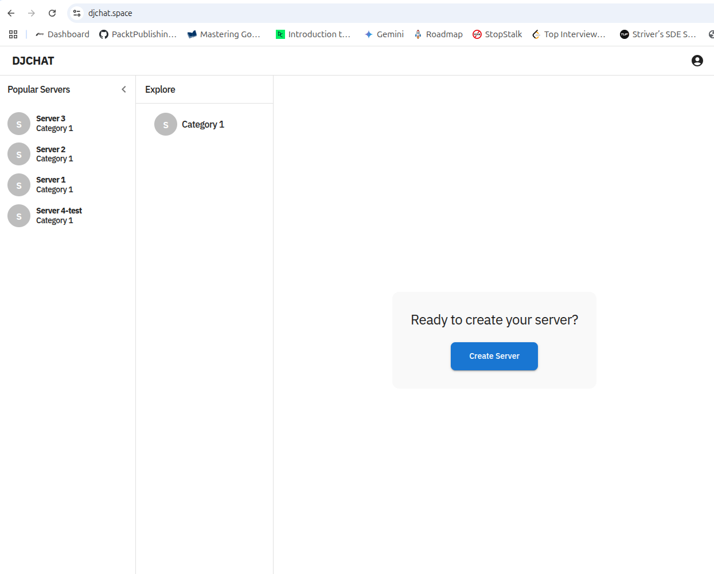
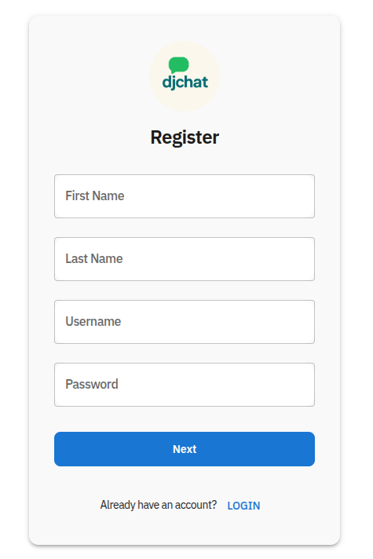
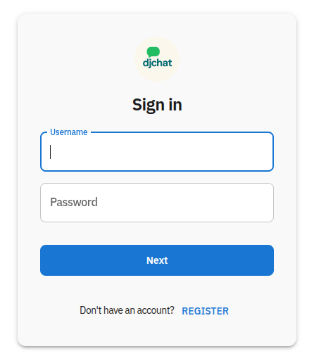
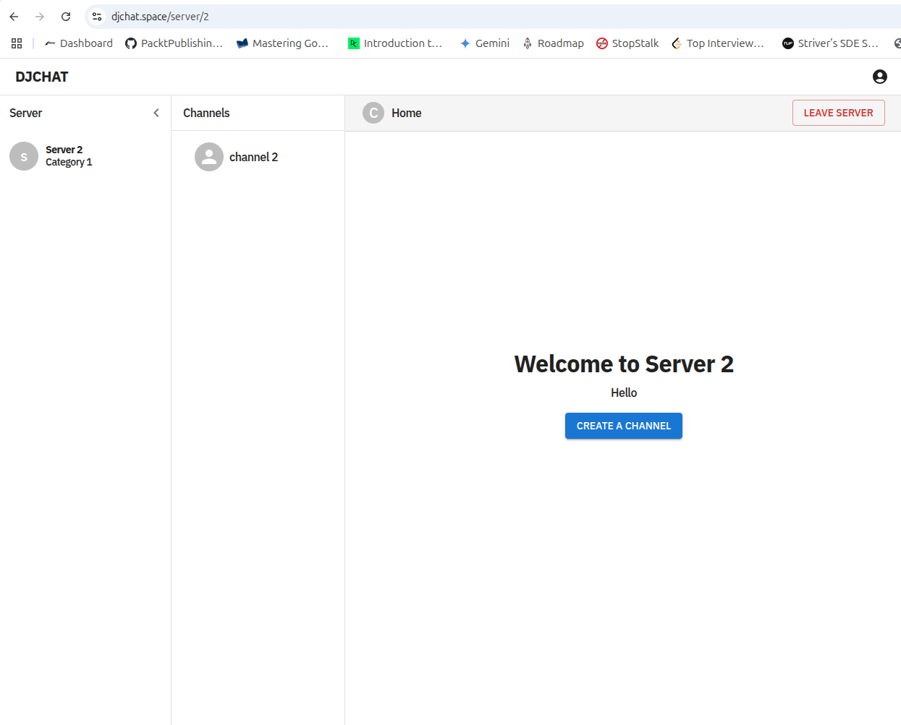
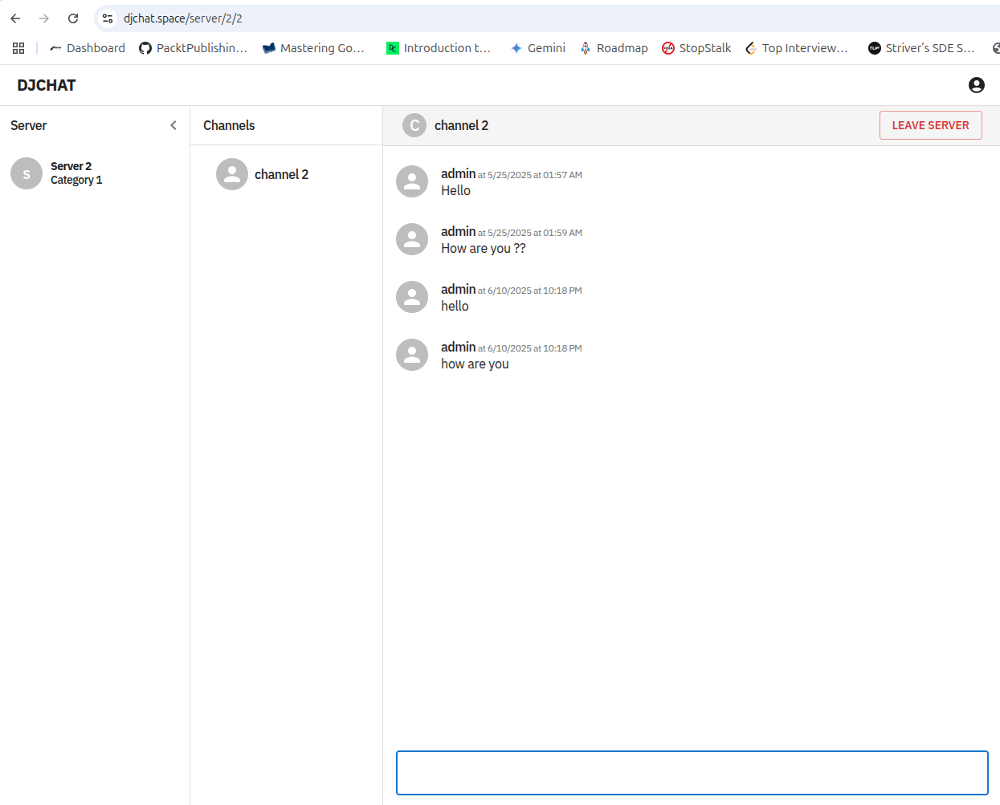

# 💬 djChat – Full Stack Real-Time Chat Application

This is a full-stack real-time chat application built using **React**, **Django**, **Django REST Framework**, and **Django Channels**. It features real-time WebSocket communication, secure JWT-based authentication, and a modern Material UI-based frontend with light/dark mode support.

---

## 🌐 Live Deployments

- 🔵 **Frontend (React)**: [https://djchat.space](https://djchat.space)
- 🔴 **API Documentation (Swagger)**: [https://backend.djchat.space/api/schema/ui/](https://backend.djchat.space)
- 📊 **API Schema**: [https://backend.djchat.space/api/schema/](https://backend.djchat.space/api/schema/)

---

## 📚 Table of Contents

- [Core Features](#-core-features)
- [Main Frontend Components](#-main-frontend-components)
- [Server Functionality](#-server-functionality)
- [API Endpoints](#-api-endpoints)
- [Challenges Faced & Solutions](#️-challenges-faced--solutions)
- [Screenshots](#️-screenshots)
- [Development Setup](#-development-setup)
- [Deployment Procedures](#️-deployment-procedures)
- [Tech Stack](#-tech-stack)
- [Key Features Implemented](#-key-features-implemented)
- [Configuration Highlights](#-configuration-highlights)

---

## 🚀 Core Features

### 🔒 Authentication

- JWT-based authentication using `djangorestframework-simplejwt`
- Access and refresh tokens handled via **HTTPOnly cookies**
- Automatic access token refresh using **Axios interceptors**
- Custom **WebSocket middleware** for JWT token validation in real-time connections

### 📡 Real-Time Chat

- Real-time communication using **WebSockets** powered by **Django Channels**
- **Custom WebSocket middleware** to validate JWT tokens for secure socket communication
- Auto-refresh access tokens during WebSocket sessions

### 🖼️ Media & Icon Handling

- File uploads with custom validations for **SVG** icon files
- Restriction on icon dimensions (e.g., **70x70px** max size)
- **User model with icon support** for profile customization

### 🌐 Frontend

- Built with **React** using **Vite**
- Styled with **Material UI**
- Uses **TanStack Router** for routing and **TanStack Query** for efficient data fetching and caching
- **Context API** used for managing global theme (light/dark mode)
- **Axios** for API requests with JWT interceptor for automatic token refreshing

### 🧠 Backend

- Django + Django REST Framework
- Authentication with **SimpleJWT**
- Real-time support with **Django Channels** + **Uvicorn** for ASGI request handling
- **drf-spectacular** + **Swagger UI** for comprehensive API documentation

---

## 🧩 Main Frontend Components

- **`PrimaryAppBar`**: Top navigation bar with user controls
- **`PrimarySidebar`**: Main navigation sidebar for server browsing
- **`SecondarySidebar`**: Contextual navigation for channels and members
- **`MainArea`**: Primary chat interface and message display

---

## 🎯 Server Functionality

- **Advanced Server Filtering**:
  - Filter by **User** (servers you're a member of)
  - Filter by **Server ID** (specific server lookup)
  - Filter by **Server Quantity** (limit results)
- Real-time **join** and **leave server** actions
- Custom validation for server-side file uploads
- Dynamic server membership management

---

## 📡 API Endpoints

The application provides a comprehensive REST API with the following key endpoints:

### Authentication Endpoints

- `POST /api/token/` - Obtain JWT access and refresh tokens
- `POST /api/token/refresh` - Refresh access token using refresh token
- `POST /api/logout` - Logout and clear HTTPOnly cookies

### Core API Endpoints

- `GET /api/server/select/` - List and filter servers
- `GET /api/categories/select/` - List server categories
- `GET /api/channel/` - List channels within servers
- `GET /api/messages/` - Retrieve chat messages
- `GET /api/user/` - User management and profiles
- `GET/POST /api/membership/{server_id}/membership/` - Server membership operations

### Documentation

- `GET /api/schema/` - OpenAPI schema
- `GET /api/schema/ui/` - Interactive Swagger UI documentation

### WebSocket Endpoints

- `ws://<server_id>/<channel_id>` - Real-time chat WebSocket connection

---

## ⚠️ Challenges Faced & Solutions

### 🚀 **Deployment Architecture**

- **Challenge**: Deploying frontend and backend to different cloud providers while maintaining same domain
- **Solution**: Configured subdomain routing with proper DNS settings and reverse proxy configuration
- **Result**: Frontend at `djchat.space` and API at `backend.djchat.space`

### 🌍 **CORS and Cookie Management**

- **Challenge**: Cross-origin requests and HTTPOnly cookie handling between different domains
- **Solution**:
  - Configured Django CORS settings for cross-domain requests
  - Set proper `SameSite` and `Secure` attributes for cookies
  - Implemented custom cookie handling for login/logout flows
- **Result**: Seamless authentication across frontend and backend

### 🔌 **Django Channels Integration**

- **Challenge**: Implementing secure WebSocket connections with JWT authentication
- **Solution**:
  - Created custom ASGI middleware for WebSocket JWT validation
  - Implemented token refresh mechanism for long-lived WebSocket connections
  - Added proper error handling for authentication failures
- **Result**: Secure real-time communication with automatic token management

### 🔐 **JWT Authentication Strategy**

- **Challenge**: Secure token storage and automatic refresh mechanism
- **Solution**:
  - Access tokens stored in memory (short-lived)
  - Refresh tokens in HTTPOnly cookies (secure, long-lived)
  - Axios interceptor for automatic token refresh
  - Custom JWT interceptor for cookie management
- **Result**: Secure, seamless authentication experience

### ⚙️ **Custom Middleware Implementation**

- **Challenge**: Validating user sessions in WebSocket connections
- **Solution**:
  - Built custom ASGI middleware to extract and validate JWT tokens
  - Implemented user scope attachment for message routing
  - Added automatic token refresh for expired sessions
- **Result**: Secure WebSocket authentication with session management

---

## 🖼️ Screenshots

### Homepage Interface



### User Registration



### Login Interface



### Server Management



### Real-Time Chat



---

## 🧪 Development Setup

### 🔧 Backend Setup

```bash
# Install dependencies
pip install -r requirements.txt

# Run migrations
python manage.py migrate

# Create superuser
python manage.py createsuperuser

# Run development server with ASGI support
python manage.py runserver
# or for WebSocket support
uvicorn djchat.asgi:application --reload
```

### 💻 Frontend Setup

```bash
# Navigate to frontend directory
cd frontend

# Install dependencies
npm install

# Start development server
npm run dev
```

---

## 🏗️ Deployment Procedures

### Frontend Deployment (Netlify)

I deployed the React frontend to Netlify following these steps:

1. **Built the production bundle**: `npm run build`
2. **Connected GitHub repository** to Netlify for automatic deployments
3. **Configured build settings**:
   - Build command: `npm run build`
   - Publish directory: `dist`
4. **Set up environment variables** in Netlify dashboard for API endpoints
5. **Configured custom domain** `djchat.space` through Netlify DNS settings
6. **Enabled automatic deploys** from the main branch for continuous deployment

### Backend Deployment (Heroku)

I deployed the Django backend to Heroku with PostgreSQL database:

1. **Created Heroku app** and connected to GitHub repository
2. **Added Heroku PostgreSQL add-on** for database service
3. **Configured environment variables** in Heroku dashboard:
   - `SECRET_KEY`, `DATABASE_URL` (auto-configured by Heroku Postgres)
   - JWT settings and CORS configurations
   - `ALLOWED_HOSTS` including the custom subdomain
4. **Set up production settings** for CORS, database, and static files
5. **Deployed using Git**: `git push heroku main`
6. **Ran database migrations**: `heroku run python manage.py migrate`
7. **Collected static files**: `heroku run python manage.py collectstatic`
8. **Configured custom subdomain** `backend.djchat.space` through DNS settings
9. **Enabled Heroku's built-in support** for both HTTP and WebSocket connections

### Cross-Domain Configuration

To handle the frontend and backend on different domains, I:

1. **Configured CORS settings** in Django to allow requests from `djchat.space`
2. **Set up proper cookie attributes** (`SameSite=None`, `Secure=True`) for cross-domain authentication
3. **Configured DNS records** to point subdomains to respective hosting providers
4. **Implemented custom cookie handling** in the frontend for cross-origin requests
5. **Set up WebSocket CORS policies** to allow connections from the frontend domain

### WebSocket Configuration

1. **Ensured Heroku supports WebSockets** (enabled by default)
2. **Configured ASGI application** with Uvicorn for WebSocket handling
3. **Set up WebSocket routing** in Django Channels for real-time chat
4. **Implemented custom middleware** for WebSocket JWT authentication
5. **Configured proper CORS policies** for WebSocket connections across domains

---

## 📦 Tech Stack

| Layer          | Technology                             |
| -------------- | -------------------------------------- |
| **Frontend**   | React (Vite), Material UI              |
| **Routing**    | TanStack Router                        |
| **Caching**    | TanStack Query                         |
| **Theming**    | React Context (Light/Dark Mode)        |
| **API Calls**  | Axios + JWT Interceptor                |
| **Backend**    | Django, Django REST Framework          |
| **Auth**       | SimpleJWT + HTTPOnly Cookies           |
| **Real-time**  | Django Channels + WebSockets + Uvicorn |
| **Docs**       | Swagger UI (drf-spectacular)           |
| **Validation** | Custom SVG icon validation             |

---

## 🎨 Key Features Implemented

### Frontend Architecture

- **Component-based design** with reusable Material UI components
- **Global state management** using React Context for theme switching
- **Efficient data fetching** with TanStack Query caching strategies
- **Responsive design** optimized for desktop and mobile devices

### Backend Architecture

- **RESTful API design** with comprehensive endpoint coverage
- **Real-time WebSocket integration** for instant messaging
- **Custom authentication middleware** for WebSocket connections
- **File upload handling** with SVG validation and size restrictions
- **User model extensions** with profile icon support

### Security Features

- **HTTPOnly cookie authentication** preventing XSS attacks
- **JWT token rotation** with automatic refresh mechanism
- **CORS configuration** for secure cross-origin requests
- **WebSocket authentication** with custom middleware validation

---

## 🔧 Configuration Highlights

- **Custom User Model**: Extended with icon field for profile customization
- **WebSocket Middleware**: Custom ASGI middleware for JWT validation
- **File Validation**: SVG-specific validation with dimension restrictions
- **Cookie Management**: Secure HTTPOnly cookie handling for authentication
- **API Documentation**: Comprehensive Swagger UI with interactive endpoints

---

This project demonstrates a production-ready full-stack application with modern web technologies, secure authentication, and real-time communication capabilities.
